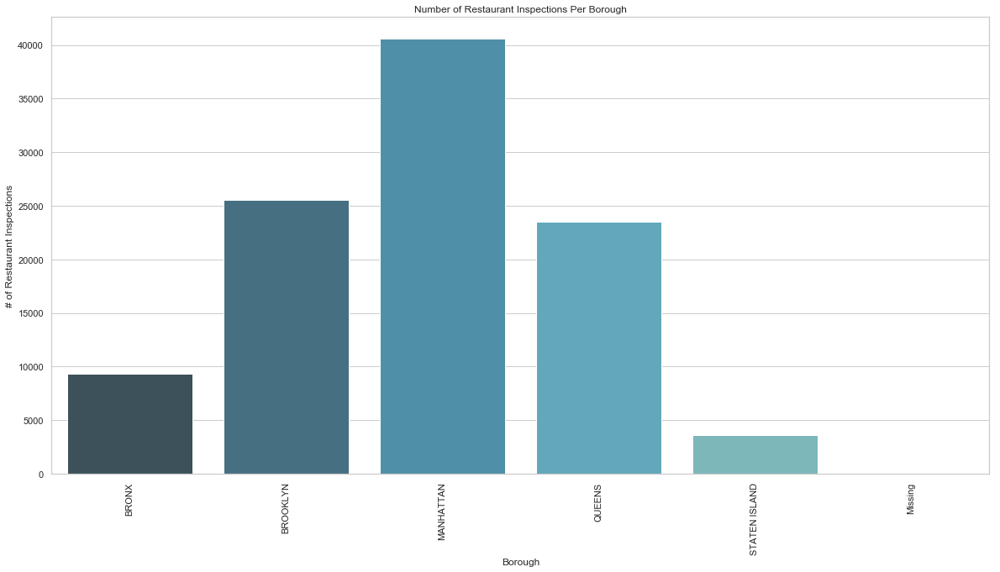
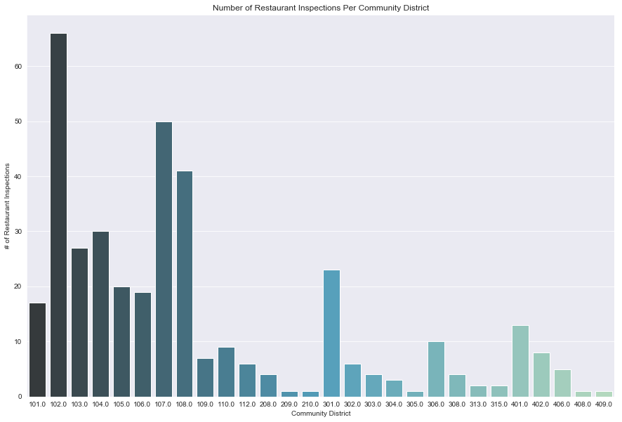
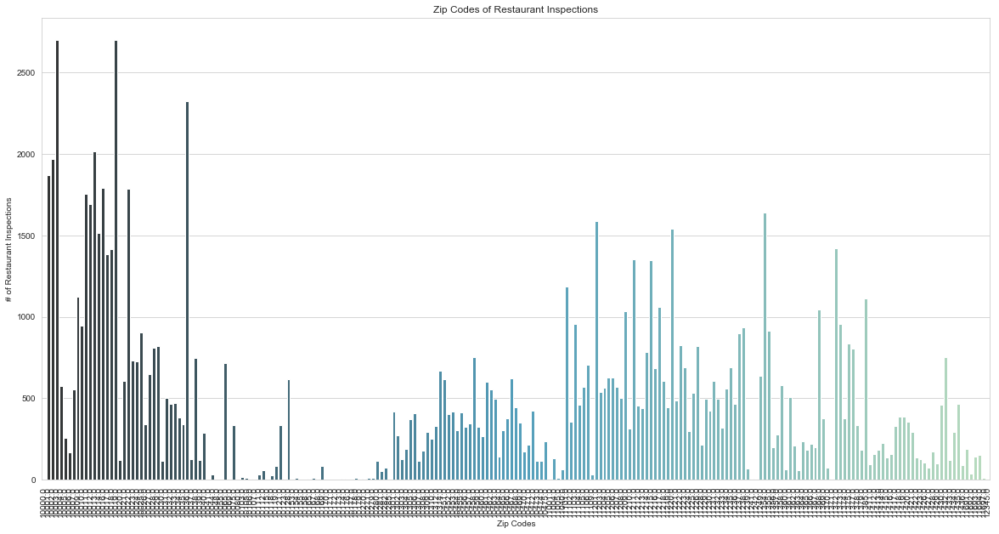
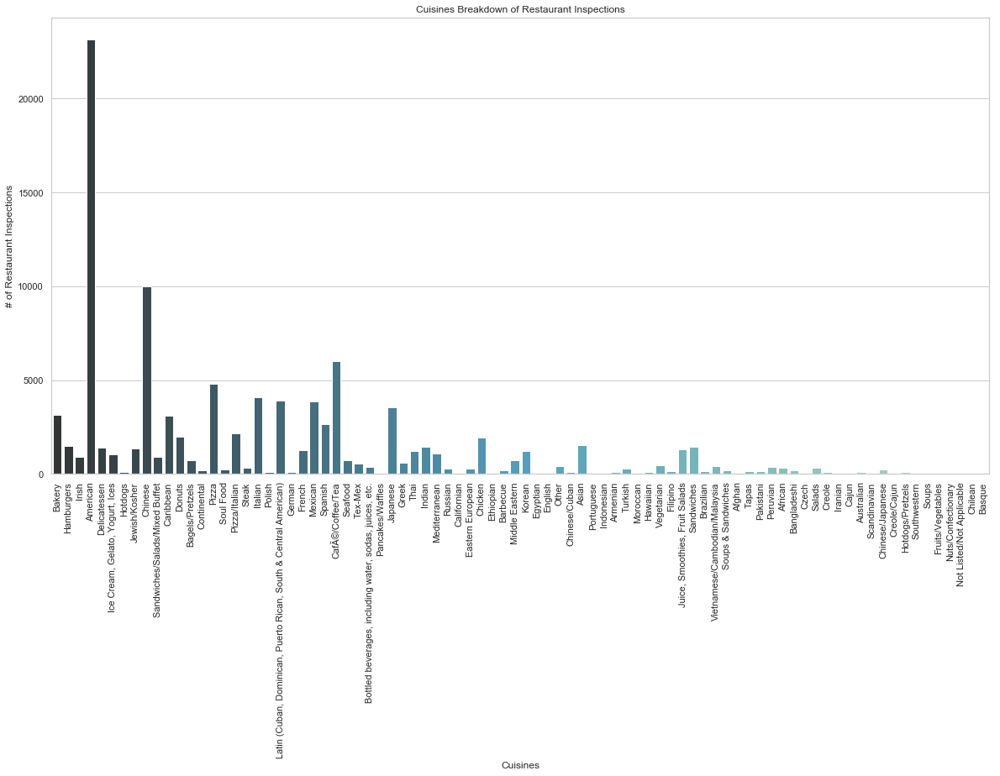
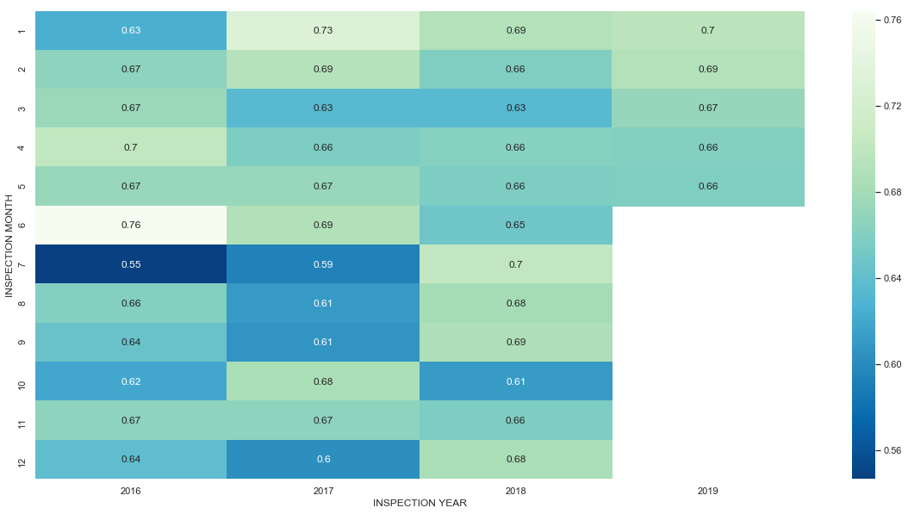
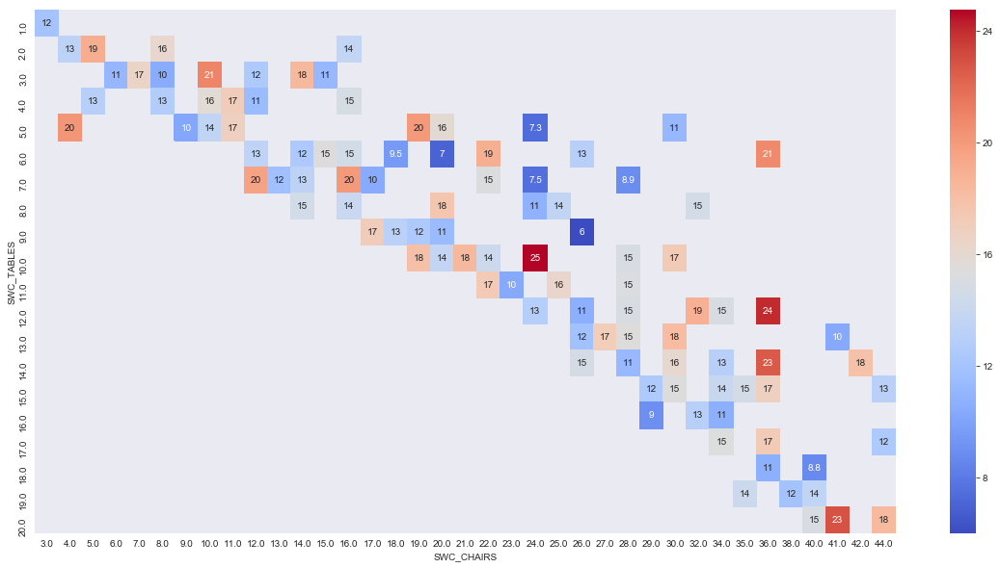
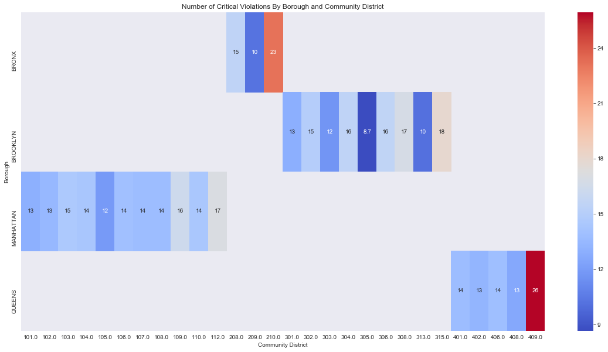

# Is It Possible to Predict a Restaurant Inspection Grade?

## Project Overview

For food service establishment owners and staff, chances are, you are well acquainted with restaurant inspections. In New York City, this is probably also the case for restaurant-goers since all restaurants are required to post their restaurant inspection grade for the public since 2010. Inspectors from the Department of Health and Mental Hygiene conduct surprise restaurant inspections throughout each year, which usually leads to panic in owners and last minute scrambles to prepare for their arrival. All owners seek to receive a restaurant inspection grade of A, which is the best. Grades below an A (ie. B, C, and so on) can cause a decrease in the customer base.

For this project, I was interested in finding the potential factors that can be used to determine if a restaurant would receive an A during their inspection. Based on research, the factors that would contribute to receiving a particular grade are the type of violations (ie. public hazard violation, critical violation, and general violation) and the points calculated from these violations leading to a score. I thought it would also be fascinating to analyze if there is are relationships between: restaurant location vs. grade, cuisine vs. grade, restaurant size vs. grade, when inspection is conducted vs. grade.

<b><u> Questions </u>:</b>
* Do the following factors affect the restaurant inspection grade?
    * Location (Borough, Zip Code, Community District)
    * Type of Violations
    * Number of Violations (Critical, Non-Critical)
    * Cuisine
    * Restaurant Size

<b><u> Target Variable </u>:</b>

The target variable for this project was restaurant inspection grade. A grade of A was expressed as a 1 and any grade other than A was expressed as a 0 in this project. Restaurant inspection score data was also available for this project and could be used as the target variable instead. However, in this case I decided to approach it as a binary classification problem instead of regression problem since the restaurant inspection grade information was available.

## Restaurant Inspection Information

Restaurants have 2 chances within an inspection cycle to receive an A. If a restaurant does not receive an A during the first inspection, it is revisited 1 month afterwards for a re-inspection. Restaurants are labeled as "Not Yet Graded" if a grade has not been provided yet.

Points are given depending on the violation commited and the final score is calculated by totaling all of the points. Each violation has a different weight depending on the severity of the violation.

In general, the following are the grade and points breakdown:

    * A: 0-13 points
    * B: 14-27 points
    * C: 28 or more points

There are situations in which only a score is given without a grade. This is perhaps one of the reasons for the null values found in the dataset. More details on how these were handled in the next paragraph. More information on the NYC Department of Health and Mental Hygiene's process for evaluating restaurants can be found online at: <a href=https://www1.nyc.gov/assets/doh/downloads/pdf/rii/how-we-score-grade.pdf>here</a>. This is also noted in the Data Sources section at the end of the page.

## Data Collection and Analysis

The NYC Restaurant Inspections Dataset was the primary data source for this project with 383,300 data points, last updated May 6th, 2019. Each point represents a citation. Additional information from the dataset on Sidewalk Cafes Licenses and Applications was later added, which had 1551 data points, last updated May 3rd, 2019. Both were obtained from NYC Open Data's website. 

### Null Value Handling

One of the challenging items of this project was handling the null values in the datasets. 

Null values in the NYC Restaurant Inspections dataset were as follows:

    

    * Some of the null values were due to listings of new restaurants that have not completed inspections yet. These were all removed. 
    * A couple of the columns with null values were ultimately dropped: BUILDING, STREET, PHONE, ACTION, VIOLATION DESCRIPTION, GRADE DATE, RECORD DATE, INSPECTION TYPE. 
    * The concerning null values were those in the target variable. Data points that had null values in SCORE and GRADE were removed. The rest were filled as NOT YET GRADED and later on, considered under the class, not an A (=0). The logic behind this came from the information provided about how restaurant inspections are scored and graded, noted in the prior section. There are times when inspections does not result in a grade but a score is provided. 
    * Because ZIPCODE is a feature I was interested in, citations that had missing zip codes were ultimately dropped. 
    * After reviewing the context around the null values in VIOLATION CODE, they were filled with None as the ACTION column stated that no violations were noted during those inspections leading to the null values. 
    * Because each data point represents a citation, many of the null values were able to be resolved by creating dummy variables for a couple of the columns and then grouping them together based on Restaurant Name (DBA), Borough (BORO), Zip Code (ZIPCODE), and Inspection Date.

Null values in the Sidewalk Cafe Licenses and Applications dataset were as follows:

    

    * All columns with null values except for ISSUANCE_DD (Date License was Issued) and SWC_SQ_FT (Cafe Size in Sq. Ft) were dropped. 
    * Data points with no information on when their licenses were issued were also dropped, as most of them were indicated to have Applications Pending. 
    * In addition, because I was interested in cafe size as a parameter, I removed any data points which were missing this information. 

### Data Wrangling and Analysis

The project was approached in ways. It was initially approached using only the NYC Restaurant Inspections dataset to see if:

    * Specific violations (each violation indicated by its code) are important factors for predicting the grade.
    * Numbers of critical and non-critical violations (indicated by Critical Flags) are important factors for predicting the grade.
    * Type of cuisine is a predictor. I thought this would be a fun point to check if there is a relationship and if yes, why is this the case.
    * Restaurant location by borough and zip code has an affect on the grade it obtains. This would be interesting because some inspectors evaluate restaurants in the same area and seeing if there are usually a cluster of restaurants with As in an area may encourage potential owners to locate their restaurants there.

#### Outliers Handling

Further data cleaning was completed during this step during outlier evaluation and handling. 

<u>NYC Restaurant Inspections Dataset</u>:

A boxplot of inspection scores showed positive skewness with outlier after 28 points. All data points with scores greater than 28 points were removed as any scores in that range are prone to shutdown. After removing these outliers, the distribution of the scores was more normal. A boxplot of inspection years showed outliers as any years below 2016. Since most recent years would be more relevant for prediction, data points from inspection years older than 2016 were also removed. 

<u>Sidewalk Cafe Licenses and Applications Dataset Merged with NYC Restaurant Inspections Dataset</u>:

A couple of outliers were also detected in scores, tables, chairs, and cafe size (sq ft) using boxplots. After reviewing the target value counts before/after the outliers were removed, some of these outliers were removed with the goal of also normalizing the class imbalance in the dataset. More caution was placed in handling these outliers as this subset of data was small - about 480 points.

#### Data Analysis

To understand the datasets, I first viewed the distributions of each feature (ie. cuisine, borough, zipcode, and community district):

    

    

    

    

Then, the fun part begins - I looked for relationships between pairs of variables as well as how grade or score is affected based on two independent variables:

<b><u>Visualizing when inspection was conducted and average inspection score</u>:</b>

    

<b><u>Visualizing restaurant size (indicated by the number of tables and chairs) and average inspection score</u>:</b>

    

<b><u>Visualizing the number of critical violations based on where inspection was conducted</u>:</b>

    

## Feature Engineering and Selection

## Machine Learning Models

## Conclusion & Next Steps

## Data Sources

- <b> Brief Information Sheet On How the NYC Health Department Scores and Grades Restaurants</b>:
    <a href=https://www1.nyc.gov/assets/doh/downloads/pdf/rii/how-we-score-grade.pdf>https://www1.nyc.gov/assets/doh/downloads/pdf/rii/how-we-score-grade.pdf</a>
    
- <b> NYC Restaurant Inspections Data </b>:
    <a href=https://data.cityofnewyork.us/Health/DOHMH-New-York-City-Restaurant-Inspection-Results/43nn-pn8j>https://data.cityofnewyork.us/Health/DOHMH-New-York-City-Restaurant-Inspection-Results/43nn-pn8j</a>

- <b> Sidewalk Cafe Licenses and Applications </b>:
    <a href=https://data.cityofnewyork.us/Business/Sidewalk-Caf-Licenses-and-Applications/qcdj-rwhu>https://data.cityofnewyork.us/Business/Sidewalk-Caf-Licenses-and-Applications/qcdj-rwhu</a>
