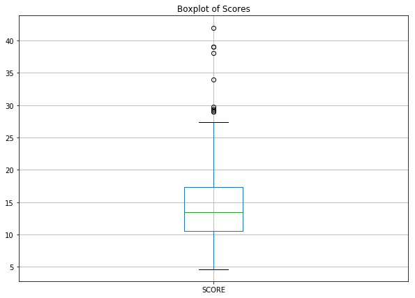

# Is It Possible to Predict a Restaurant Inspection Grade?

## Project Overview

For this project, I was interested in investigating the possibility of predicting if a restaurant would receive an A during their inspection. Based on research, the factors that would contribute to receiving a particular grade are the type of violations (ie. public hazard violation, critical violation, and general violation) and the points calculated from these violations leading to a score. I thought it would also be fascinating to analyze if there are relationships between: restaurant location vs. grade, cuisine vs. grade, restaurant size vs. grade, and when inspection is conducted vs. grade. As the project progressed, I added in other features such as restaurant size and duration since the restaurant has been open by merging in another dataset. 

<b><u> Questions </u>:</b>
* Do the following factors affect the restaurant inspection grade?
    * Location (Borough, Zip Code, Community District)
    * Type of Violations
    * Number of Violations (Critical, Non-Critical)
    * Cuisine
    * Restaurant Size

<b><u> Target Variable </u>:</b>

The target variable for this project was restaurant inspection grade. A grade of A was expressed as a 1 and any grade other than A was expressed as a 0 in this project. Restaurant inspection score data was also available for this project and could be used as the target variable instead. However, in this case I decided to approach it as a binary classification problem instead of regression problem since the restaurant inspection grade information was available.

## Background Information

For food service establishment owners and staff, chances are, you are well acquainted with restaurant inspections especially since all restaurants in NYC are required to post their restaurant inspection grade for the public since 2010. Inspectors from the Department of Health and Mental Hygiene conduct surprise restaurant inspections throughout each year, which usually causes panic in owners and last minute scrambles to prepare for their arrival. All owners want a restaurant inspection grade of A. Grades below an A (ie. B, C, and so on) can cause a decrease in the customer base.

Restaurants have two chances within an inspection cycle to receive an A. If a restaurant does not receive an A during the first inspection, it is revisited 1 month afterwards for a re-inspection. Restaurants are labeled as "Not Yet Graded" if a grade has not been provided yet.

Points are given depending on the violation commited and the final score is calculated by totaling all of the points. Each violation has a different weight depending on the severity of the violation.

In general, the following are the breakdown of grade and points:

   * A: 0-13 points
   * B: 14-27 points
   * C: 28 or more points

There are situations in which only a score is given but not a grade. This is perhaps one of the reasons for the null values found in the dataset. More details on how these were handled in the next section. More information on the NYC Department of Health and Mental Hygiene's process for evaluating restaurants can be found online at: <a href=https://www1.nyc.gov/assets/doh/downloads/pdf/rii/how-we-score-grade.pdf>here</a>. The link is also listed in the Data Sources section at the end of the page.

## Data Collection and Analysis

The NYC Restaurant Inspections Dataset was the primary data source for this project with 383,300 data points, last updated May 6th, 2019. Each row represents a citation. Additional information from the dataset on Sidewalk Cafes Licenses and Applications was later added, which had 1551 data points, last updated May 3rd, 2019. Both were obtained from NYC Open Data's website. 

### Null Value Handling

One of the challenging aspects of this project was handling the null values in the datasets. 

Null values in the NYC Restaurant Inspections dataset were as follows:

    

   * Key issue: Grade, which is the target variable, contains a large number of null values.
   * The following steps were taken to clean up this situation:
       * Any rows that had null values in both the Scores and Grade columns were removed.
       * Remaining rows with null values in Grade columns were closely examined and the following can be noted:
           * Scores were given for each citation but ultimately a grade was not given. According to documentation from the Department of Health (DOHMH), there are times when scores may be given but not grade. One restaurant can have more than one citation (more than one row).
           * I grouped and aggregated together the data based on restaurant information, and inspection date to view the null values. Most were due to a high score (>14 points) during their initial inspection, which can lead to no grade being given at the time and for the DOHMH to return for a re-inspection.
           * For this reason, since it is unclear if the restaurants have been reinspected since this occurence, I followed the DOHMH's guideline to mark the null values as Not Yet Graded. A note is that this may cause a class imbalance but this slowly shifts along the rest of the process.
           * Some of the null values were due to listings of new restaurants that have not completed inspections yet. These were all removed as all other columns also did not contain any useful information.
   * A couple of the columns with null values were ultimately dropped: BUILDING, STREET, PHONE, ACTION, VIOLATION DESCRIPTION, GRADE DATE, RECORD DATE, INSPECTION TYPE. 
   * Because ZIPCODE is a feature I was interested in, citations that had missing zip codes were ultimately dropped. 
   * After reviewing the context around the null values in VIOLATION CODE, they were filled with None as the ACTION column stated that no violations were noted during those inspections leading to the null values. 
   * Most of the null values were able to be resolved by creating dummy variables for a couple of the columns (ie. Inspection Month, Inspection Year) and then grouping the rest of the dataframe restaurant information.

Null values in the Sidewalk Cafe Licenses and Applications dataset were as follows:

    

   * All columns with null values except for ISSUANCE_DD (Date License was Issued) and SWC_SQ_FT (Cafe Size in Sq. Ft) were dropped. 
   * Data points with no information on when their licenses were issued were also dropped, as most of them were indicated to have Applications Pending. 
   * In addition, because I was interested in cafe size as a parameter, I removed any data points which were missing this information. 

### Data Wrangling and Analysis

The project was initially approached using only the NYC Restaurant Inspections dataset to see if:

   * Specific violations (each violation indicated by its code) are important factors for predicting the grade.
   * Numbers of critical and non-critical violations (indicated by Critical Flags) are important factors for predicting the grade.
   * Type of cuisine is a predictor. I thought this would be a fun point to check if there is a relationship and if yes, why is this the case.
   * Restaurant location by borough and zip code has an affect on the grade it obtains. This would be interesting because some inspectors evaluate restaurants in the same area and seeing if there are usually a cluster of restaurants with As in an area may encourage potential owners to locate their restaurants there.

Afterwards, I added the Sidewalk Cafe Licenses and Applications dataset and added the following features:

   * Duration the business has been open for (calculated by subtracting the license issuance date from 5/9/19)
   * Restaurant size (sq. ft)

All specific violation dummy variables were removed instead as it would be difficult to interpret how each violation affects the grade since the number of points for each violation is unknown (I was unable to find the rubric).

#### Outliers Handling

Further data cleaning was completed during this step during outlier evaluation. 

<u>NYC Restaurant Inspections Dataset</u>:

A boxplot of inspection scores showed positive skewness with outliers after 28 points. All data points with scores greater than 28 points were removed as any scores in that range are prone to shutdown. After removing these outliers, the distribution of the scores was more normal. A boxplot of inspection years showed outliers as any years below 2016. Since most recent years would be more relevant for prediction and the values are all 0s, data points from inspection years older than 2016 were also removed. 

      

<u>Sidewalk Cafe Licenses and Applications Dataset Merged with NYC Restaurant Inspections Dataset</u>:

A couple of outliers were also detected in scores, tables, chairs, and cafe size (sq ft) using boxplots. After reviewing the target value counts before/after the outliers were removed, some of these outliers were removed with the goal of also normalizing the class imbalance in the dataset. More caution was placed in handling these outliers as this subset of data was small - about 381 points. The tables and chairs columns were ultimately dropped as they were highly correlated with cafe size (sq ft) after reviewing the correlation matrix, discussed in next section.

      

      

#### Data Analysis

To begin, I took a look at the pairwise correlation matrix chart to see if there are any pair of features that are strongly correlated. 

<u>NYC Restaurant Inspections Dataset</u>:

Here is a heatmap showing the correlation matrix for a subset of features:

    

The following was noted:

   * Strongly correlated:
       * Critical Violations x Score: 0.82
        
   * Moderately correlated:
       * Score x Grade: -0.601886
       * Violation__22E x Violation__06G: 0.664572
       * Violation__08A x Violation__04L: 0.6537
        
<u>Sidewalk Cafe Licenses and Applications Dataset Merged with NYC Restaurant Inspections Dataset</u>:

Here is a heatmap showing the correlation matrix for a subset of features:

    

The following was noted:

   * Strongly correlated:
       * Zip Code x Manhattan: -0.98
       * Zip Code x Community District: 0.97
       * Zip Code x City Council District: 0.96
       * Manhattan x Community District: -0.96
       * Tables x Chairs: 0.94
       * Manhattan x City Council District: -0.93
       * Community District x City Council District: 0.88
       * Tables x Sq Ft: 0.88
       * Chairs x Sq Ft: 0.83
       * Brooklyn x City Council District: 0.85
       * Zip Code x Brooklyn: 0.75
       * Critical Violations x Non Critical Violations: 0.74
       * Queens x Community District: 0.73
       * Brooklyn x Manhattan: -0.72
        
   * Moderately correlated:
       * Score x Critical Violations: 0.59
       * Brooklyn x Community District: 0.58
       * Zip Code x Queens: 0.55
       * Queens x Manhattan: -0.54

## Feature Engineering and Selection

Dummy variables were created for all categorical variables.In the initial approach with only data from the NYC Restaurant Inspections dataset, feature selection was not done prior to running the machine learning models. However, in the next approach with merging the Sidewalk Cafes Licenses and Applications dataset, feature selection was done through feature importance with Decision Tree modelling. The top 200 most important features were selected for the model.

## Machine Learning Models

In both the inital and subsequent approaches, the dataset was split 80/20 into training and testing sets. Class imbalance was evaluated and fixed in the training set. After which, the training data was also scaled before modelling.

<b><u> Class Imbalance Evaluation for Initial Approach</u>:</b>

    

Class imbalance was fixed using undersampling. Samples were taken from the majority class (restaurants with A) without replacement to create a class with a size that matched the minority class.

<b><u> Class Imbalance Evaluation for Subsequent Approach</u>:</b>

    

Class imbalance was fixed using SMOTE. New minority class points were synthesizes beside existing minority points. 

Logistic regression, KNN, decision tree, and random forest models were run in both approaches. For the initial approach only, after baseline models were created, a randomized search was conducted to find the best parameters for each kind of model in the initial approach.

<b><u>Results with NYC Restaurant Inspections Data Only</u>:</b>

The best model was random forest with best parameters provided through randomized search. The best parameters were:

   * 'n_estimators': 200
   * 'min_samples_leaf': 0.05
   * 'max_features': 0.35
   * 'max_depth': 4

The accuracy scores and F1 scores for training and testing were:

   * <b>Train Accuracy score</b>:  0.859071138430569
   * <b>Train F1 score</b>:  0.8732931499765687

   * <b>Test Accuracy score</b>:  0.896551724137931
   * <b>Test F1 score:  0.9255050505050505

The confusion matrices for the training and testing were:

      

<b><u>Results with NYC Restaurant Inspections Data Merged with Sidewalk Cafe Licenses and Applications Data</u>:</b>

Out of the three models run, the best one seems to be logistic regression. However, this is only because the confusion matrix yielded from using the model to predict from the training data was balanced compared to the results from the other two models. When the model was fit to the testing data, due to the large class imbalance in the actual/testing data, although it showed high accuracy and F1 scores, it was only predicting the true positives because the majority class were restaurants who received an A.

The accuracy scores and F1 scores for training and testing were:

   * <b><u>Training Accuracy Score</u>:</b> 0.9967105263157895
   * <b><u>Training F1 Score</u>:</b> 0.9966996699669968
   
   * <b><u>Testing F1 Score</u>:</b> 0.9803921568627451
   * <b><u>Testing Accuracy Score</u>:</b> 0.9967105263157895

The confusion matrices for the training and testing were:

      

## Conclusion & Next Steps

Although the model from the initial approach look promising, the features used in the modelling are not actionable. Therefore this model cannot be used in practical use. On the other hand, there were more interesting features in the subsequent approach such as restaurant size (sq ft), which is highly correlated with number of tables and chairs, which can be acted upon depending on their weights on predicting the grade. However, the significant class imbalance present in the actual data 

After a week working on this project, although I found some interesting insights, unfortunately, I was unable to finalize a model that could predict the inspection grade with actionable features. However, if I continue to work on this, the next steps would be:

   * More data (ie. Yelp API)
   * Additional feature engineering (ie. interaction terms)
   * Try removing the score as a feature

## Data Sources

- <b> Brief Information Sheet On How the NYC Health Department Scores and Grades Restaurants</b>:
    <a href=https://www1.nyc.gov/assets/doh/downloads/pdf/rii/how-we-score-grade.pdf>https://www1.nyc.gov/assets/doh/downloads/pdf/rii/how-we-score-grade.pdf</a>
    
- <b> NYC Restaurant Inspections Data </b>:
    <a href=https://data.cityofnewyork.us/Health/DOHMH-New-York-City-Restaurant-Inspection-Results/43nn-pn8j>https://data.cityofnewyork.us/Health/DOHMH-New-York-City-Restaurant-Inspection-Results/43nn-pn8j</a>

- <b> Sidewalk Cafe Licenses and Applications </b>:
    <a href=https://data.cityofnewyork.us/Business/Sidewalk-Caf-Licenses-and-Applications/qcdj-rwhu>https://data.cityofnewyork.us/Business/Sidewalk-Caf-Licenses-and-Applications/qcdj-rwhu</a>
